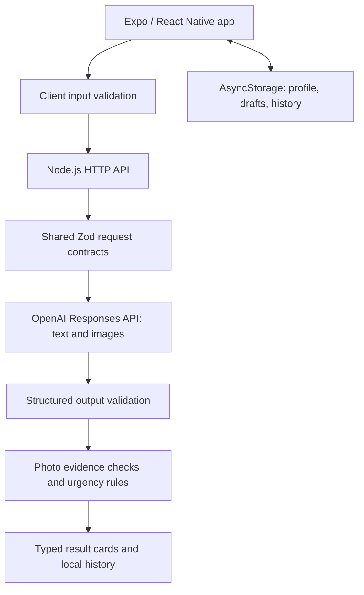

# Pet Health Assistant

**A cross-platform AI assistant that helps pet owners organize symptoms, understand visible behavior, and explore possible emotional needs.**

Built with **React Native, Expo, TypeScript, Node.js, and the OpenAI Responses API**, Pet Health Assistant combines text and image inputs with structured assessments, reusable pet profiles, and local assessment history. It supports three distinct starting points: a symptom assessment, a photo-based behavior analysis, or an independent emotion assessment.

> **Project status:** Functional portfolio prototype with automated contract and API tests. Intended for educational guidance, not veterinary diagnosis. Live AI quality and physical-device acceptance testing remain separate validation work.

[Features](#features) · [Architecture](#architecture) · [Getting started](#getting-started) · [Testing](#testing) · [Project structure](#project-structure)

## Overview

Pet owners often have observations rather than a clear question: a change in appetite, an unfamiliar posture, or a pet hiding after a change in routine. This project turns those observations into an organized assessment with possible explanations, urgency, practical next steps, and explicit limitations.

The application is designed around three principles:

- **Multiple ways to start.** Health uses a detailed intake, while Behavior and Emotion work without a completed pet profile or prior assessment.
- **Evidence-aware results.** Photo observations reference numbered images; possible emotions are presented as interpretations rather than confirmed feelings.
- **Clear boundaries.** Urgent-sign guidance appears immediately, API failures are visible, and demonstration data is explicitly labeled.

## Features

### Health assessment

A structured intake collects pet species, age, weight, symptoms, onset, and recent changes. Owners can add a name, breed, existing conditions, and allergies or food restrictions.

The assessment provides:

- Possible causes and a **Low / Medium / High** urgency level.
- Suggested next steps and signs to watch for.
- General food, feeding-frequency, and hydration guidance.
- An immediate emergency notice when an urgent sign is selected, before any AI request completes.

Health retains its required profile and symptom fields. Age and weight include explicit units, and other species require a species description.

### Behavior analysis

Upload **1–8 photos** of the same pet and episode to explore posture and visible behavior. Background information about triggers, surroundings, and recent events is optional.

- No completed Health assessment or pet profile required.
- Available profile details are automatically summarized and included.
- Add/remove controls and numbered image previews.
- JPEG conversion, compression, and resizing to a maximum long edge of 1,280 pixels before upload.
- Structured behavior tags, photo references, evidence explanations, and subjective AI confidence estimates.

Still photos are treated as limited observations; the application does not claim to measure movement, breathing rate, or repeated behavior from them.

### Emotion assessment

Start directly with **photos, a written description, or both**. With no photos, the description must contain at least eight characters.

- No prior Health or Behavior result required.
- Pet profiles are optional; existing details are automatically reused.
- Separate photo and description inputs from Behavior.
- Possible emotional states, supporting explanations, calming guidance, and environmental suggestions.
- Text-only assessments cannot return invented photo observations.

When a current Health or Behavior result exists, an **optional combined summary** can integrate those assessments. This is a separate action and does not block independent emotion analysis. Its urgency cannot fall below either supplied assessment.

### Shared care space

- One active pet profile shared across all three features.
- Up to **10 timestamped assessments** stored locally.
- Result sharing through the platform share interface, with a clipboard fallback on supported browsers.
- Connection settings for the API address, an optional server access token, and a connectivity check.
- Local-data clearing from the privacy settings.
- A consistent four-tab interface with reusable forms, notices, and result cards.

## User flows

| Entry point      | Required input                                           | Optional input                                          | Requires an earlier assessment? |
| ---------------- | -------------------------------------------------------- | ------------------------------------------------------- | ------------------------------- |
| Health           | Required pet details, symptoms, and onset                | Breed, conditions, allergies, recent-change information | No                              |
| Behavior         | 1–8 photos                                               | Pet profile and behavior context                        | No                              |
| Emotion          | At least one photo **or** a description of 8+ characters | Pet profile; photos and text can be combined            | No                              |
| Combined summary | A current Health or Behavior result                      | Both results for additional context                     | Yes                             |

Saved profile information enriches an analysis without becoming a mandatory onboarding step for Behavior or Emotion. Partial profiles are supported: unknown age or weight is omitted rather than converted into a fabricated value.

## Architecture



### Technical stack

| Layer          | Implementation                                                               |
| -------------- | ---------------------------------------------------------------------------- |
| Client         | React Native 0.81, React 19, Expo SDK 54                                     |
| Navigation     | Expo Router with Home, Health, Behavior, and Emotion tabs                    |
| Language       | TypeScript across client, server, and shared contracts                       |
| State          | React Context and hooks; AsyncStorage for selected local data                |
| Image handling | Expo ImagePicker and ImageManipulator                                        |
| API            | Node.js HTTP server, executed with `tsx`                                     |
| AI integration | OpenAI Responses API with strict JSON-schema output; default model `gpt-4.1` |
| Validation     | Zod request and response schemas                                             |
| Testing        | Node.js test runner, mocked provider responses, HTTP integration tests       |
| Code quality   | TypeScript, ESLint, Prettier                                                 |

### Engineering decisions

**Shared contracts across the network boundary.** Client inputs are checked before submission, and the API validates requests again. AI output must pass both structured-output parsing and application-level checks before being shown.

**Independent workflows with shared context.** Behavior and Emotion accept optional or partial profiles while Health keeps its stricter requirements. Each photo workflow has its own inputs. A separate summary request preserves the original combined-assessment capability.

**Protection against outdated results.** Editing profile or symptom details invalidates current assessments. Changes to Behavior photos/context invalidate its result and the combined summary; Emotion edits invalidate its own result. Revision checks discard responses when relevant state changes during an in-flight request.

**Explicit request lifecycles.** Requests support cancellation, a 55-second client deadline, and a 45-second provider timeout. Invalid responses, refusals, unavailable credentials, quota errors, and network failures produce actionable errors rather than fabricated results.

**Server-side provider credentials.** The client calls the project API, which calls OpenAI. Provider keys are never required in the mobile or web bundle.

## Getting started

### Prerequisites

- Node.js **22 or later** and npm.
- An OpenAI API key with access to the configured model for live analysis.
- For native iOS development: macOS, Xcode, and CocoaPods.
- For native Android development: the Android SDK and a configured emulator or device.

The project also declares a development Node binary dependency so npm scripts can use the supported runtime after installation.

### Install and configure

From the repository root:

```sh
npm install
```

Create a local environment file if one does not already exist:

```sh
cp .env.example .env
```

Set the server-side key in `.env`:

```dotenv
OPENAI_API_KEY=your_api_key_here
OPENAI_MODEL=gpt-4.1
API_PORT=8787
API_HOST=127.0.0.1
```

Keep the remaining settings from `.env.example`, then start the app and API together:

```sh
npm run dev
```

- Web app: **http://localhost:8082**
- API status: **http://localhost:8787/api/status**

The development command starts both processes. Changes to `.env` restart the API automatically; stop both with `Ctrl+C`. Client-side environment changes may require restarting Expo and reloading the app.

### Configuration

| Variable              | Purpose                                            | Default / behavior                                              |
| --------------------- | -------------------------------------------------- | --------------------------------------------------------------- |
| `OPENAI_API_KEY`      | Server-side provider credential                    | Required for live AI analysis                                   |
| `OPENAI_MODEL`        | Model supporting image input and structured output | `gpt-4.1`                                                       |
| `API_PORT`            | API listening port                                 | `8787`                                                          |
| `API_HOST`            | API listening interface                            | `127.0.0.1`; use `0.0.0.0` for trusted LAN testing              |
| `EXPO_PUBLIC_API_URL` | Optional client API address                        | Otherwise inferred from the development host, using port `8787` |
| `ALLOWED_ORIGINS`     | Comma-separated browser origin allowlist           | Localhost / loopback on ports `8081` and `8082`                 |
| `API_ACCESS_TOKEN`    | Shared access token for a private instance         | Optional in development; required for production analysis       |
| `NODE_ENV`            | Enables production access-control enforcement      | Set to `production` for deployment                              |
| `EXPO_PORT`           | Expo port used by `npm run dev`                    | `8082`                                                          |

An API URL entered in **Home → Connection & privacy** takes precedence over the configured/default address. If changing the API port, update the client address as well.

### Run on a phone

1. Connect the phone and development computer to the same trusted network.
2. Set `API_HOST=0.0.0.0` in `.env` so the API accepts LAN connections.
3. Open the app through a compatible Expo Go installation or a native development build.
4. If needed, set the API URL in Connection settings to `http://YOUR_COMPUTER_LAN_IP:8787`.
5. Allow local-network access when prompted and use **Test connection** to verify reachability.

A phone’s `localhost` refers to the phone, not the development computer. Opening Expo through a tunnel does not automatically expose the separate API server.

For native builds, keep the API running in another terminal:

```sh
npm run server
# In a second terminal, choose one:
npm run ios
npm run android
```

The iOS native project is checked in; Expo generates the Android native project when needed for a local Android build. Native dependency or permission changes require rebuilding a custom development client. Release builds require an **HTTPS** API address.

## Testing

```sh
npm run typecheck
npm run lint
npm test
npm run build:web
npm run build:all
```

`build:all` exports web assets and iOS/Android JavaScript/Hermes bundles; it does not create signed store binaries.

### Automated coverage

The current suite contains **21 passing tests**, including:

- Required Health fields and optional/partial profiles for independent workflows.
- Photo count, transport, and evidence-reference validation.
- Emotion requests using only text or only photos.
- Structured output, missing fields, refusal, and incomplete-response handling.
- Emergency overrides and combined-summary urgency preservation.
- Credentials, quota, network errors, deadlines, and cancellation.
- HTTP authorization, CORS, request size limits, and rate limiting.
- Production requests failing closed without access control.
- Checks for provider secrets and direct provider endpoints in client source.

Provider calls in automated tests are mocked. Passing tests verify application behavior, not medical accuracy or live model quality.

### Demo mode without an API key

```sh
npm run test:ui-server
```

This starts an isolated fixture API at **http://localhost:8788**. Enter that URL in the web app’s Connection settings to exercise result cards, sharing, and history. Every fixture result is labeled **TEST FIXTURE**. Restore the API override to blank afterward.

The real API never silently falls back to this service. This fixture server binds to loopback and is intended for local browser testing.

### Verification status

| Area                                       | Status                                                                                                         |
| ------------------------------------------ | -------------------------------------------------------------------------------------------------------------- |
| Latest workflow revision                   | TypeScript, ESLint, and 21 automated tests passed                                                              |
| Browser interaction                        | Independent entry screens, profile summaries, empty-input validation, and earlier result/history flows checked |
| Web and mobile bundle exports              | Passed during the earlier implementation; not rerun after the latest workflow revision                         |
| Native iOS compilation                     | Earlier unsigned simulator build passed for arm64 and x86_64; not a physical-device test                       |
| Live provider evaluation                   | Pending valid provider credentials and representative test cases                                               |
| Physical-device photo/lifecycle acceptance | Still required                                                                                                 |
| Veterinary review and user study           | Not completed                                                                                                  |

See [the verification report](docs/TEST_REPORT.md) for details and remaining acceptance items.

## API overview

### `GET /api/status`

Returns:

```json
{ "configured": true }
```

`configured` indicates that a provider key is present. It does **not** validate the key, model access, billing, or quota.

### `POST /api/analyze`

Accepts a validated JSON request containing:

| Field            | Meaning                                                                |
| ---------------- | ---------------------------------------------------------------------- |
| `kind`           | `health`, `behavior`, `emotion`, or `summary`                          |
| `profile`        | Required complete Health profile; nullable/partial for other workflows |
| `case`           | Symptom intake; empty symptom/onset strings allowed outside Health     |
| `context`        | Behavior or emotion description                                        |
| `images`         | Up to eight base64 JPEG data URLs for Behavior/Emotion                 |
| `healthResult`   | Current Health result for a combined summary, otherwise `null`         |
| `behaviorResult` | Current Behavior result for a combined summary, otherwise `null`       |

The response is `{ "result": ... }`; errors use `{ "error": "..." }`. The complete request and result definitions live in [`shared/contracts.ts`](shared/contracts.ts).

The API enforces a 13 MB request-body limit, at most four concurrent analyses, and an in-memory limit of ten analysis requests per IP per minute. These controls apply per server process.

## Data and privacy

| Data                                                                  | Handling                                                                |
| --------------------------------------------------------------------- | ----------------------------------------------------------------------- |
| Pet profile, Health draft, Behavior context, API URL, last 10 results | Stored locally using AsyncStorage                                       |
| Selected photos, Emotion draft, current result state, access token    | Held in app memory; not persisted to AsyncStorage                       |
| Submitted analysis inputs                                             | Sent to the project API and then OpenAI when the user requests analysis |
| Photos and results on the API server                                  | No application database or persistent storage                           |

Local storage is not encrypted. Image-processing tools or the operating system may retain temporary cache files. Historical results remain available after a reload, but they are not automatically reused as current assessments.

OpenAI requests set `store: false`; this is not a claim of zero provider retention. The server does not log request bodies or photos. Keep provider credentials in server environment variables, never in `EXPO_PUBLIC_*` variables or committed files. `.env` files are ignored; `.env.example` contains configuration placeholders.

## Deployment considerations

The frontend and API are separate deployment units:

- Export the web app with `npm run build:web` and host the generated `dist/` directory.
- Run the Node API on a service that supports the project’s Node runtime and dependencies.
- Configure a public HTTPS API URL for the client and allow the frontend origin in `ALLOWED_ORIGINS`.
- Set `NODE_ENV=production`, `OPENAI_API_KEY`, and `API_ACCESS_TOKEN` on the API host. Enter the access token in the app’s Connection settings.

The current shared-token access model is intended for a private instance. A public multi-user release would need per-user authentication, deployment-aware rate limiting, operational monitoring, and a reviewed privacy policy. No public deployment or app-store release is included in the repository.

## Limitations and future work

- **Educational assistance:** results are not diagnoses and do not replace veterinary care.
- **Still-image input:** no video processing, motion tracking, or continuous monitoring.
- **Uncalibrated confidence:** scores are model estimates, not clinically validated probabilities.
- **Single active pet:** no multi-pet account system or cloud synchronization.
- **English interface:** localization is not yet implemented.
- **Evaluation work:** live text/vision evaluation, physical-device acceptance, veterinary review, user feedback, and a recorded demo remain future work.

Potential extensions include multi-pet profiles, account-based synchronization, localization, stronger provider evaluation datasets, and video-based observation after appropriate validation.

## Project structure

```text
app/                      Expo Router screens and tab layout
components/               Reusable controls, photo input, profile summary, results
lib/
  api.ts                  API address resolution and requests
  use-analysis.ts         Validation, request lifecycle, cancellation
  store.tsx               Shared state, persistence, result invalidation
  optional-profile.ts     Extraction of valid optional profile fields
shared/contracts.ts       Shared Zod schemas, types, safety messages
server/
  index.ts                HTTP routes, access control, request limits
  analysis.ts             Provider integration, output and safety validation
scripts/                  Development launcher and isolated UI fixture server
tests/                    Contract, provider, and HTTP integration tests
assets/                   App artwork, icons, and fonts
ios/                      Native iOS project
docs/                     Product brief, syllabus mapping, demo script, test report
```

## Supporting documents

- [Product brief](docs/PRODUCT_BRIEF.md)
- [Syllabus coverage and acceptance checklist](docs/SYLLABUS.md)
- [Demo recording script](docs/DEMO.md) — a script, not a completed recording.
- [Verification report](docs/TEST_REPORT.md)

## Portfolio highlights

This project demonstrates full-stack TypeScript development, cross-platform interface design, multimodal AI integration, shared runtime validation, asynchronous state management, and deterministic API testing.

The implementation includes independent text/image workflows, optional shared context, structured AI results, stale-response protection, server-side credential handling, and explicit boundaries between tested software behavior and unverified model quality.
